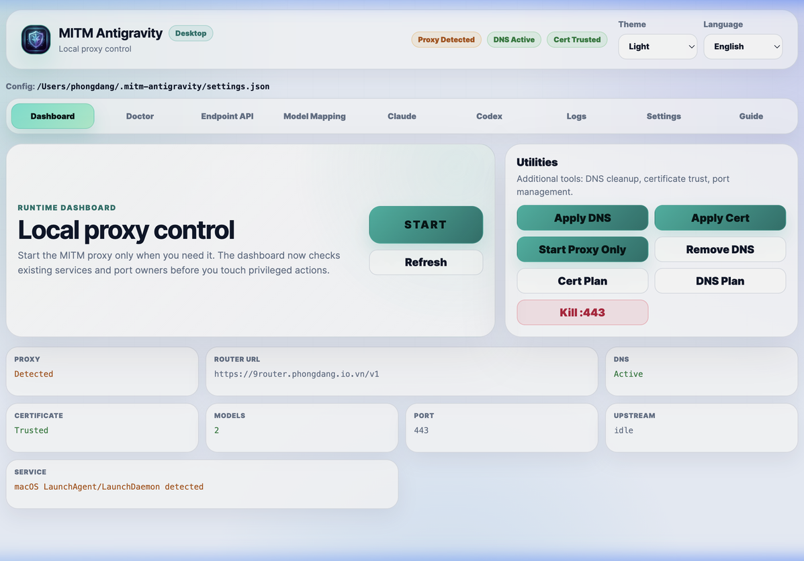
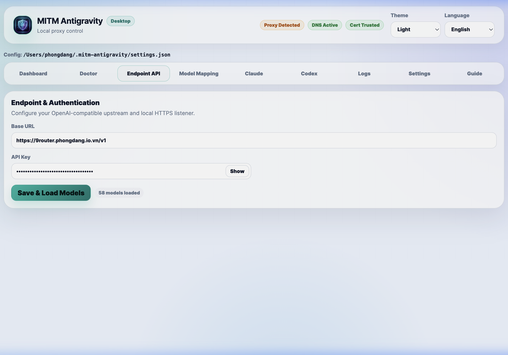
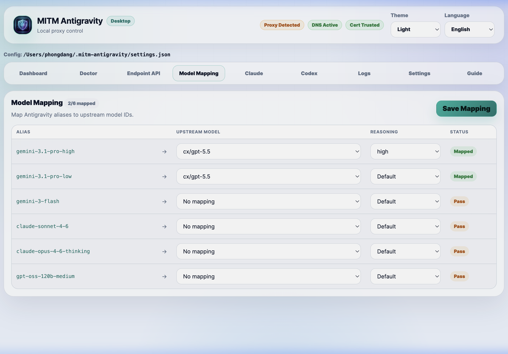
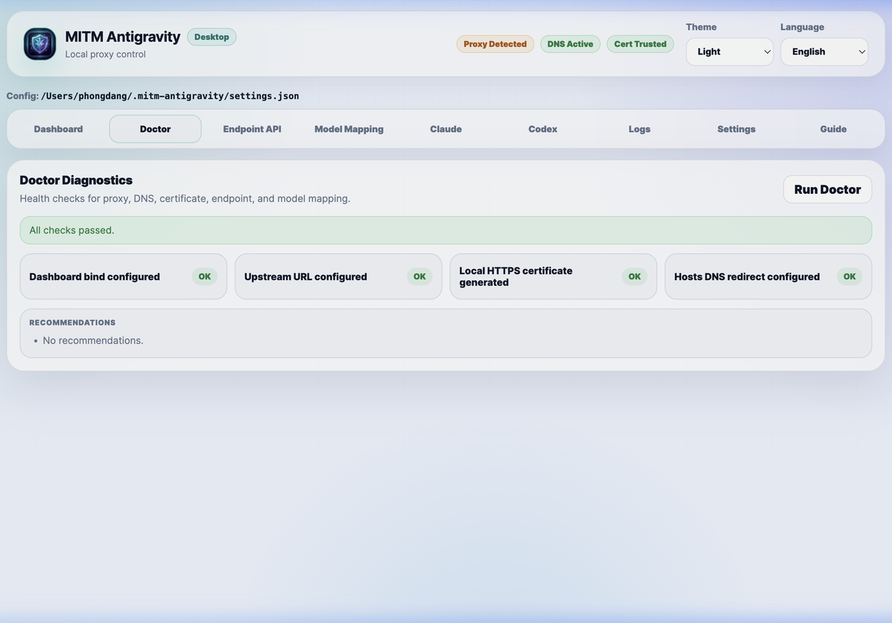

# MITM Antigravity

<p align="center">
  <strong>Local-first proxy and desktop control panel for routing Google Antigravity model requests to OpenAI-compatible upstreams.</strong>
</p>

<p align="center">
  <a href="#features">Features</a> ·
  <a href="#quick-start">Quick Start</a> ·
  <a href="#configuration">Configuration</a> ·
  <a href="#cli-reference">CLI</a> ·
  <a href="#build">Build</a> ·
  <a href="#safety">Safety</a>
</p>

<p align="center">
  
  
  
  
  
</p>

---

## Overview

**MITM Antigravity** runs a local HTTPS proxy for selected Google Antigravity traffic.
It can generate and trust a local TLS certificate, redirect configured Antigravity
hosts to your machine, inspect supported generation requests, and forward mapped
model calls to your own OpenAI-compatible endpoint.

Use it as either:

- **Desktop GUI** — visual control panel for setup, configuration, model mapping,
  proxy control, diagnostics, and logs.
- **CLI/backend binary** — standalone command-line tool for scripting or direct
  proxy operation.

> [!IMPORTANT]
> This tool can modify local networking and certificate trust settings. Use it only
> on machines you control, and review the safety notes before applying setup.

---

## Features

- 🔁 **Local HTTPS proxy** for selected Antigravity generation endpoints.
- 🧭 **Conservative routing**: unmapped and non-target traffic passes through.
- 🧩 **Explicit model mapping** from Antigravity aliases to upstream models.
- 🔌 **OpenAI-compatible upstream** endpoint support.
- 🖥️ **Desktop control panel** with configuration, logs, diagnostics, and themes.
- 🪟 **Windows installer** with NSIS hooks for clean install/upgrade/uninstall.
- 🔑 **Cross-platform certificate trust** — automatic `NODE_EXTRA_CA_CERTS` on both macOS and Windows.
- 🌐 **English/Vietnamese UI labels** for a smoother local workflow.
- 📦 **Import/export configuration** as portable JSON.
- 🧪 **Doctor diagnostics** for readiness checks and actionable troubleshooting.
- 🔐 **Secret-aware logging** with redaction for common sensitive values.
- 🛠️ **Cross-platform builds** via `@yao-pkg/pkg` and Tauri.

---

## Screenshots

| Dashboard | Endpoint API |
| --- | --- |
|  |  |

| Model Mapping | Doctor |
| --- | --- |
|  |  |

---

## Requirements

| Use case | Requirements |
| --- | --- |
| Source development | Node.js 20+, npm |
| Desktop build | Rust toolchain + Tauri prerequisites |
| System setup | Administrator privileges for certificate and hosts/DNS changes |
| Release binary | Matching platform build, no Node.js required |

---

## Quick Start

### 1. Install dependencies

```bash
npm install
```

### 2. Launch the GUI

```bash
node index.js gui
```

Open:

```text
http://127.0.0.1:20245/
```

Useful options:

```bash
node index.js gui --ui-port 20246
node index.js gui --no-open
```

### 3. Configure your upstream

In the GUI:

1. Open **Config**.
2. Enter your upstream endpoint and API key.
3. Load available upstream models.
4. Open **Model Mapping**.
5. Map Antigravity aliases to upstream models.
6. Save mapping and reload the proxy.

### 4. Apply local setup and start

Open **Proxy & System**:

- Click **Apply DNS & Cert** once to generate/trust the certificate and update hosts.
- Click **START** to start the local proxy.
- Click **STOP** to stop it.

The GUI does **not** store your administrator password. Your OS will prompt for
elevation when needed.

On macOS, setup installs a local root CA and applies `NODE_EXTRA_CA_CERTS` via
`launchctl`. On Windows, setup writes `NODE_EXTRA_CA_CERTS` to both User and
Machine environment variables. Fully quit and reopen Antigravity after applying
setup so the app inherits the updated trust environment.

---

## Release Binary

The backend binary can run directly without installing Node.js.

### Windows

```powershell
.\mitm-antigravity-win-x64.exe --help
.\mitm-antigravity-win-x64.exe gui
```

Run PowerShell or Command Prompt as Administrator when applying certificate or
hosts setup.

### macOS

```bash
./mitm-antigravity-macos-arm64 --help
./mitm-antigravity-macos-arm64 gui
```

If macOS blocks an unsigned private build, allow it from **System Settings →
Privacy & Security**, or remove quarantine:

```bash
xattr -dr com.apple.quarantine ./mitm-antigravity-macos-arm64
```

---

## Configuration

Runtime settings are stored under the user profile:

```text
~/.mitm-antigravity/settings.json
```

Inspect config paths:

```bash
node index.js config paths
```

Initialize or print the redacted current configuration:

```bash
node index.js config init
node index.js config list
```

Set values from the CLI:

```bash
node index.js config set \
  routerUrl=https://your-endpoint.example.com/v1/chat/completions \
  apiKey=sk-your-key \
  modelMap.gemini-3-flash=your-upstream-model
```

Example shape:

```json
{
  "activeMachine": "your-machine-name",
  "machines": {
    "your-machine-name": {
      "routerUrl": "https://your-endpoint.example.com/v1/chat/completions",
      "apiKey": "sk-your-key",
      "modelMap": {
        "gemini-3-flash": "your-upstream-model"
      }
    }
  }
}
```

> [!WARNING]
> Never publish personal configs, API keys, generated certificates, or private
> `settings.local.json` / `config.local.json` files.

---

## Import / Export

Export current configuration:

```bash
node index.js export-config
node index.js export-config --output backup.json
```

Import configuration:

```bash
node index.js import-config backup.json
```

Exported metadata is included for traceability. Runtime-only metadata is ignored
when importing.

---

## Model Mapping

MITM Antigravity is intentionally conservative:

- Authentication and bootstrap traffic pass through.
- Unmapped model requests pass through to Google.
- Only explicitly mapped generation requests are routed to your upstream endpoint.

Primary built-in aliases:

```text
gemini-3.1-pro-high
gemini-3.1-pro-low
gemini-3-flash
claude-sonnet-4-6
claude-opus-4-6-thinking
gpt-oss-120b-medium
```

> [!TIP]
> 18 aliases are recognized in total (including Gemini 2.5 family, Flash variants, and Tab preview models). The GUI model mapping page shows all available aliases.

Start with one-off mappings:

```bash
node index.js start \
  --endpoint https://your-endpoint.example.com/v1/chat/completions \
  --api-key sk-your-key \
  --map gemini-3-flash=your-upstream-model \
  --map claude-sonnet-4-6=your-other-upstream-model
```

Force all intercepted requests to one upstream model:

```bash
node index.js config set model=your-upstream-model
```

Enable broad interception only if you understand the behavior:

```bash
node index.js start --always-intercept
```

---

## CLI Reference

```text
mitm-antigravity [command] [options]

Commands:
  start              Start the local HTTPS proxy
  setup              Apply DNS/hosts and certificate setup
  stop               Stop the proxy
  cleanup            Stop proxy and remove managed DNS entries
  doctor             Run diagnostics
  status             Print current status
  gui                Start the local GUI
  wizard             Run interactive setup wizard
  config             Manage runtime configuration
  export-config      Export configuration to JSON
  import-config      Import configuration from JSON
  uninstall-cert     Remove managed certificate
```

Recommended flow:

```bash
node index.js wizard
node index.js setup
node index.js start --skip-setup
node index.js doctor
node index.js stop
```

Common commands:

```bash
node index.js gui
node index.js wizard
node index.js status
node index.js doctor
node index.js cleanup
```

Useful options:

| Option | Description |
| --- | --- |
| `--target-hosts` | Comma-separated Antigravity hosts to redirect. |
| `--remote-ip` | IP written to hosts. Default: `127.0.0.1`. |
| `--port` | Local HTTPS proxy port. Default: `443`. |
| `--endpoint`, `--router-url` | Upstream chat completion endpoint. |
| `--api-key` | Upstream bearer token. |
| `--model` | Force intercepted requests to one upstream model. |
| `--map source=target` | Add a model mapping. Can be repeated. |
| `--model-map-file` | Read mappings from a JSON file. |
| `--skip-setup` | Start proxy without modifying cert or hosts. |
| `--ui-port` | Local GUI port. Default: `20245`. |
| `--no-open` | Start GUI server without opening a browser. |

---

## Build

### CLI/backend binaries

Build a backend binary for the current platform:

```bash
pnpm run build:pkg:native
```

Build binaries for all supported platforms:

```bash
pnpm run build:pkg:all
```

Output:

```text
dist/mitm-antigravity-macos-arm64
dist/mitm-antigravity-macos-x64
dist/mitm-antigravity-win-x64.exe
dist/mitm-antigravity-win-arm64.exe
dist/mitm-antigravity-linux-x64
dist/mitm-antigravity-linux-arm64
dist/settings.json
```

`dist/settings.json` is a stripped release settings file (no API keys or model mappings).

### Tauri desktop app

Build the native desktop app for the current OS:

```bash
pnpm run build
```

Build the Windows installer specifically:

```bash
pnpm run tauri:build:windows              # standard NSIS installer
pnpm run tauri:build:windows:bootstrapper # includes WebView2 bootstrapper
pnpm run tauri:build:windows:offline      # bundles WebView2 offline
```

On macOS, output is written under:

```text
src-tauri/target/release/bundle/macos/MITM AG.app
```

On Windows, the NSIS installer is output as `MITM.AG_<version>_x64-setup.exe`.
The installer includes hooks that automatically stop running MITM AG processes
before install/upgrade and before uninstall.

Tauri bundles are native-platform builds. Build Windows installers on Windows or
in a dedicated CI/cross-build environment.

---

## Project Structure

```
mitm-antigravity/
├── index.js                  CLI entrypoint
├── src/
│   ├── index.js              Public re-export hub (used by tests)
│   ├── cli/
│   │   ├── args.js           --flag parser
│   │   ├── commands.js       Command dispatch (start/stop/gui/wizard…)
│   │   └── wizard.js         Interactive setup wizard
│   ├── config/
│   │   ├── constants.js      App-wide constants (aliases, loopback IPs…)
│   │   └── index.js          Config read/write/merge (settings.json)
│   ├── cert/
│   │   └── index.js          TLS CA + server cert, system trust (macOS/Windows)
│   ├── dns/
│   │   └── index.js          /etc/hosts management (IPv4 + IPv6 blocking)
│   ├── proxy/
│   │   ├── index.js          HTTPS proxy server, intercept/passthrough
│   │   ├── manager.js        GUI-facing lifecycle controller
│   │   ├── control.js        Detached start/stop/health-check, LaunchDaemon
│   │   ├── helpers.js        Routing logic, retry, header building
│   │   ├── ide-version.js    Antigravity IDE version normalization
│   │   ├── internal-instruction-sanitizer.js  Response leak sanitizer
│   │   ├── kiro.js           Kiro provider request normalization
│   │   ├── memory.js         Proxy buffer limits and memory errors
│   │   ├── reasoning.js      Reasoning effort helpers
│   │   ├── request-log.js    Recent request preview logging
│   │   ├── schema.js         Tool JSON Schema coercion
│   │   └── logger.js         Compact log formatters (MAP/OK/ERR/RETRY)
│   ├── models/
│   │   ├── index.js          Model mapping, extraction, alias resolution
│   │   ├── list.js           Antigravity model list builder (18 aliases)
│   │   └── serialization.js  Response decode/summarize
│   ├── system/
│   │   ├── index.js          exec, execWithSudo, execPowerShell, openBrowser
│   │   ├── autostart.js      LaunchAgent / Scheduled Task / systemd
│   │   ├── http.js           collectBodyRaw, sendJson
│   │   └── logging.js        appendLog, readRecentLogs, redactText
│   └── gui/
│       ├── index.js          GUI HTTP server + route handlers
│       ├── routes.js         Route table
│       ├── api-utils.js      sendHtml, sendApiError
│       ├── client.js         Browser JS (rendered inline)
│       ├── i18n.js           EN / VI translations
│       ├── styles.js         CSS (rendered inline)
│       └── template.js       HTML template
├── src-tauri/                Tauri 2 desktop app shell (Rust)
│   └── installer-hooks.nsh   NSIS hooks (stop processes on install/uninstall)
├── scripts/
│   ├── build-pkg.js          Cross-platform pkg builder
│   ├── check-js.js           Syntax check scanner for JS files
│   ├── copy-settings.js      Stripped settings for release
│   ├── diagnose-bypass.js    Local proxy/DNS/mapping diagnostics
│   ├── prepare-tauri.js      Tauri sidecar preparation
│   ├── settings-sanitizer.js Remove secrets from settings
│   ├── tauri-build-windows.js Windows-specific Tauri build
│   ├── kill-windows-proxy.cmd / .ps1 Windows port cleanup helper
│   ├── kill-mitm-ag.command  macOS: stop all MITM AG processes (double-click)
│   ├── kill-mitm-ag.sh       Linux/macOS: stop backend process
│   ├── kill-mitm-ag.bat      Windows: stop all MITM AG processes
│   └── kill-mitm-ag-backend.bat  Windows: stop backend only
├── tauri-ui/                 Loading screen shown before GUI is ready
└── test/                     Node.js built-in test suite
```

> [!NOTE]
> Generated outputs such as `dist/`, `src-tauri/target/`, `target-gui-test/`,
> and packaged Tauri resources are intentionally ignored. Recreate them through
> the build scripts instead of committing them.

---

## Development

Run syntax checks:

```bash
pnpm run check
```

Run tests:

```bash
pnpm test
```

Start Tauri development mode:

```bash
pnpm run tauri:dev
```

---

## Safety

- Setup installs a local root CA and generates a per-host TLS server certificate.
- Hosts redirection affects configured target hosts system-wide (IPv4 **and** IPv6).
- Only selected generation endpoints are intercepted; other paths pass through.
- If Antigravity or the runtime uses certificate pinning, interception may fail.
- Do not commit local secrets, API keys, generated certificates, or private configs.
- Review logs before sharing them publicly, even though common secrets are redacted.
- **API key storage**: the API key is stored in plaintext in `~/.mitm-antigravity/settings.json`. This file is user-readable only (`0600`). Do not store highly sensitive keys without additional OS-level protection.
- **Windows**: `NODE_EXTRA_CA_CERTS` is set in both User and Machine environment variables. The NSIS installer stops running processes before install/upgrade/uninstall. If elevation is cancelled, the app provides actionable error messages.
- **Linux**: certificate auto-install is not supported. Trust the CA manually: `sudo cp ~/.mitm-antigravity/cert/ca.crt /usr/local/share/ca-certificates/ && sudo update-ca-certificates`. DNS and proxy start/stop operations require the app to be run with `sudo`, or use the CLI `--password` flag.
- The GUI does **not** store or transmit your administrator password. Elevation is handled entirely by OS dialogs (osascript on macOS, UAC on Windows).

To restore normal networking, stop the proxy and remove managed DNS entries:

```bash
node index.js cleanup
```

To stop all running MITM AG processes without the GUI, use the kill scripts:

```bash
# macOS — double-click or run in Terminal
scripts/kill-mitm-ag.command

# Windows — run in PowerShell/cmd
scripts\kill-mitm-ag.bat
```

---

## License

MIT
