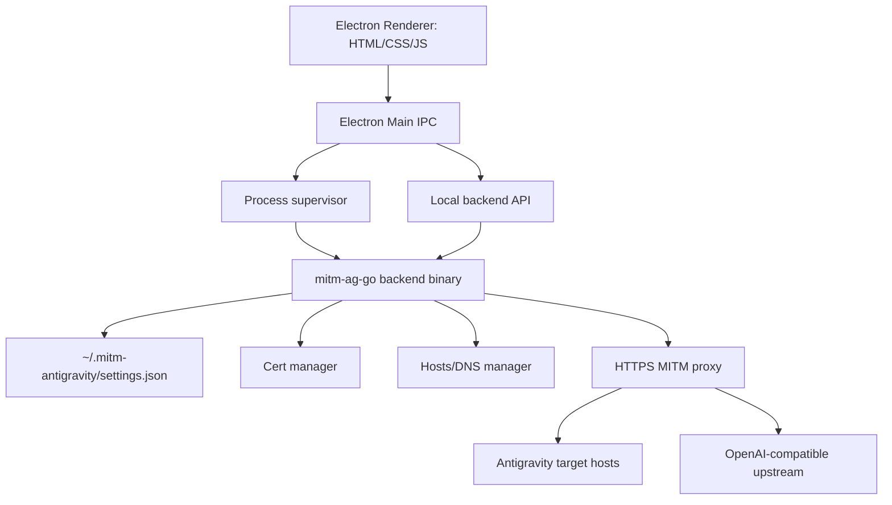

# Feasibility Plan: Go Backend + Electron UI

Mục tiêu: đánh giá tính khả thi khi đổi project hiện tại từ **Node.js + Tauri/pkg** sang **Go backend + Electron desktop UI**, đồng thời tạo hướng migration an toàn, không làm mất chức năng proxy hiện có.

Branch làm việc:

```text
feasibility-go-electron
```

## Current Architecture Snapshot

Project hiện tại là một app local-first gồm:

| Layer | Hiện tại | Vai trò |
| --- | --- | --- |
| CLI/backend | Node.js CommonJS | Parse command, setup, start/stop proxy, doctor |
| HTTPS proxy | Node.js `https` + `fetch` | MITM proxy, passthrough/intercept, stream upstream response |
| Config | JSON under `~/.mitm-antigravity` | Machine profile, endpoint, API key, model map |
| Cert/DNS | Node helpers + shell/PowerShell | Trust cert, hosts/DNS redirect, cleanup |
| GUI web server | Node local web server | Serve HTML/CSS/JS GUI routes |
| Desktop wrapper | Tauri v2 | Bundle GUI + backend binary |
| Release binary | `pkg` | Build standalone Node binary |
| Tests | `node --test` | Unit + smoke tests |

## Feasibility Verdict

> [!IMPORTANT]
> Chuyển sang **Go backend** là khả thi và có lợi cho phần proxy/process control/release binary. Chuyển sang **Electron UI** cũng khả thi, nhưng sẽ tăng kích thước app và chi phí packaging so với Tauri.

### Recommended Direction

Nên làm theo hướng **incremental migration**, không rewrite một phát:

1. **Phase 0 — Architecture freeze**: khóa behavior hiện tại bằng tests.
2. **Phase 1 — Electron shell dùng backend Node hiện tại**: thay Tauri bằng Electron trước, giữ backend cũ để giảm rủi ro UI.
3. **Phase 2 — Go backend parity**: port CLI/proxy/config/cert/DNS sang Go, chạy song song với Node backend trong branch.
4. **Phase 3 — Switch Electron to Go backend**: Electron spawn Go binary thay Node/pkg binary.
5. **Phase 4 — Remove old Tauri/pkg path** sau khi parity ổn.

### Why Not One-shot Rewrite?

Một lần rewrite toàn bộ có rủi ro cao vì project này có nhiều điểm nhạy cảm:

- TLS certificate generation/trust store.
- Hosts/DNS modification requiring admin privilege.
- HTTPS MITM passthrough correctness.
- Streaming response behavior.
- macOS LaunchDaemon and Windows elevated process start.
- Existing GUI route contracts.
- Cross-platform packaging.

## Target Architecture



### Backend Language: Go

Suggested Go modules:

```text
cmd/mitm-ag/main.go
internal/config
internal/models
internal/proxy
internal/proxylog
internal/control
internal/cert
internal/dns
internal/system
internal/guiapi
```

### Desktop Layer: Electron

Suggested Electron structure:

```text
electron/
  main.js
  preload.js
  package.json
  assets/
  renderer/              # can reuse current static GUI initially
backend-go/
  go.mod
  cmd/mitm-ag/main.go
  internal/...
```

## Component Migration Map

| Current JS module | Go target | Risk | Notes |
| --- | --- | --- | --- |
| `src/models.js` | `internal/models` | Low | Pure logic, easiest to port first |
| `src/config.js` | `internal/config` | Low/Medium | Must preserve settings JSON compatibility |
| `src/logging.js` | `internal/proxylog` | Low | Keep one-line redacted logs |
| `src/http.js` | `internal/httpx` or inline | Low | Body collection/JSON response helpers |
| `src/proxy-helpers.js` | `internal/proxy` | Medium | Preserve routing classification exactly |
| `src/proxy.js` | `internal/proxy/server.go` | High | TLS, streaming, passthrough, retry semantics |
| `src/cert.js` | `internal/cert` | High | Cross-platform trust-store commands |
| `src/dns.js` | `internal/dns` | High | Hosts mutation safety and sudo/elevation |
| `src/proxy-control.js` | `internal/control` | High | Start/stop elevated process behavior |
| `src/gui.js` | Electron main + Go API | Medium | Decide API shape: HTTP localhost vs IPC wrapper |
| `src/gui/client.js` | Electron renderer | Low/Medium | Can reuse current vanilla HTML/CSS/JS |
| `src-tauri/` | Electron packaging | Medium | New installer/signing pipeline |

## Proposed Migration Phases

### Phase 0 — Lock Current Behavior

#### Goals
- Add/expand tests before migration.
- Document behavior that must remain identical.

#### Work
- Snapshot current CLI commands and expected outputs.
- Add golden tests for model mapping, `thinking` handling, request classification, proxy passthrough/intercept decisions, and config import/export compatibility.

#### Exit Criteria
- `npm run check && npm test` passes.
- Behavior matrix documented.

---

### Phase 1 — Electron Shell Over Existing Node Backend

#### Goals
- Prove Electron UI without touching backend logic.
- Reuse current static GUI assets.

#### Work
- Add Electron dev dependency and minimal main process.
- Electron main starts current backend GUI server or loads local static UI.
- Preserve current API routes.
- Add scripts: `electron:dev`, `electron:build`.

#### Exit Criteria
- Electron app opens existing GUI.
- Config, logs, doctor, start/stop buttons still work.

---

### Phase 2 — Build Go Backend Parity

#### Goals
- Implement Go backend that can run independently as CLI and local API.

#### Work Order
1. `internal/models`
2. `internal/config`
3. `internal/logging`
4. `internal/proxy` request classification
5. HTTPS proxy passthrough/intercept
6. Cert manager
7. DNS/hosts manager
8. Process control/autostart equivalents
9. CLI command parity

#### Technical Notes
- Use Go `net/http` + `httputil` or custom reverse proxy logic.
- For outbound upstream, use `http.Client` with streaming copy.
- For self-signed cert generation, use Go `crypto/x509`.
- For trust-store/hosts changes, keep shell/PowerShell commands but wrap safely.

#### Exit Criteria
- Go CLI can run `config list`, `doctor`, `start --skip-setup --port 9443`, serve `/_mitm_health`, and stop by port.
- Go tests pass.
- Node and Go outputs match for config/model logic.

---

### Phase 3 — Electron Uses Go Backend

#### Goals
- Electron spawns Go binary and talks to its local API.

#### Work
- Define stable localhost API or stdio IPC protocol.
- Prefer HTTP localhost for easier debugging and reuse of existing GUI client.
- Electron main supervises Go process lifecycle.
- Add port selection and startup readiness checks.
- Bundle platform-specific Go binary with Electron.

#### Exit Criteria
- Electron app works without Node backend.
- App can start/stop proxy, show logs, and run diagnostics.

---

### Phase 4 — Deprecate Tauri/pkg Path

#### Goals
- Remove old build path only after parity is proven.

#### Work
- Update README and release docs.
- Remove or archive `src-tauri` and `pkg` config.
- Keep migration notes for rollback.

#### Exit Criteria
- CI/release scripts produce Electron installers.
- Manual smoke test passes on macOS and Windows.

## Electron vs Tauri Tradeoff

| Dimension | Tauri current | Electron proposed |
| --- | --- | --- |
| App size | Smaller | Larger |
| Web compatibility | Good | Excellent |
| Node integration | Limited/native bridge | Native to Electron main |
| Packaging familiarity | Rust/Tauri required | Node ecosystem, electron-builder/forge |
| Security surface | Smaller | Larger, must harden IPC |
| Existing project fit | Already present | Migration cost |
| Windows installer | Current NSIS via Tauri | Mature via electron-builder |

> [!WARNING]
> Electron is not automatically simpler. It removes Rust/Tauri friction but introduces IPC security, larger binaries, and Chromium packaging overhead.

## Key Risks

### MITM Proxy Semantics

Risk: Go proxy changes streaming, headers, TLS behavior, or passthrough behavior.

Mitigation:
- Add proxy behavior tests before port.
- Keep request classification identical.
- Use byte-copy streaming and preserve critical headers.

### Certificate Trust Store

Risk: OS trust commands differ subtly from current JS scripts.

Mitigation:
- Keep command behavior documented.
- Implement dry-run/doctor diagnostics.
- Manual test on macOS and Windows.

### Elevated Process Control

Risk: Start/stop behavior on privileged port 443 breaks.

Mitigation:
- Initially develop on non-privileged port `9443`.
- Port privileged flow after core proxy is stable.
- Keep explicit diagnostics for port owner and readiness logs.

### Electron Security

Risk: unsafe renderer access to Node APIs.

Mitigation:
- Use `contextIsolation: true`.
- Use `nodeIntegration: false`.
- Expose narrow preload API only.
- Validate IPC payloads.

### Release Complexity

Risk: Multi-platform Go + Electron build scripts become complex.

Mitigation:
- First build current OS only.
- Add CI matrix after local parity.
- Keep artifact naming explicit.

## Recommended First Implementation Scope

> [!IMPORTANT]
> Nếu mục tiêu là đánh giá thực tế nhanh, scope đầu tiên nên là **Electron shell + Go model/config prototype**, chưa port full proxy ngay.

### First PR Scope

- Keep this plan in `docs/go-electron-feasibility.md`.
- Add `electron/` minimal shell loading existing GUI.
- Add `backend-go/` skeleton with:
  - `go.mod`
  - `internal/models`
  - tests equivalent to current model mapping tests.
- Do not remove Tauri yet.

### Not in First PR

- No full proxy rewrite.
- No certificate trust rewrite.
- No privileged port start/stop rewrite.
- No removal of existing Node/Tauri flow.

## Verification Plan

### Current Branch Baseline

```bash
npm run check
npm test
```

### Electron Prototype

```bash
npm run electron:dev
```

Manual checks:
- App window opens.
- Existing GUI routes render.
- Config tab loads.
- Logs tab loads.

### Go Prototype

```bash
go test ./...
go run ./cmd/mitm-ag --help
```

### Later Full Backend Smoke Test

```bash
go run ./cmd/mitm-ag start --skip-setup --port 9443
curl -k -H 'Host: antigravity.googleapis.com' https://127.0.0.1:9443/_mitm_health
```

## Open Questions

> [!IMPORTANT]
> Anh muốn Electron chỉ là wrapper cho Go backend local API, hay muốn Electron main process trực tiếp quản lý phần config/logs và chỉ gọi Go cho proxy?

> [!IMPORTANT]
> Có cần giữ Tauri song song lâu dài, hay mục tiêu cuối là thay hoàn toàn bằng Electron?

> [!WARNING]
> Go backend nên giữ compatibility 100% với `~/.mitm-antigravity/settings.json`, hay được phép đổi schema config cho v2?
